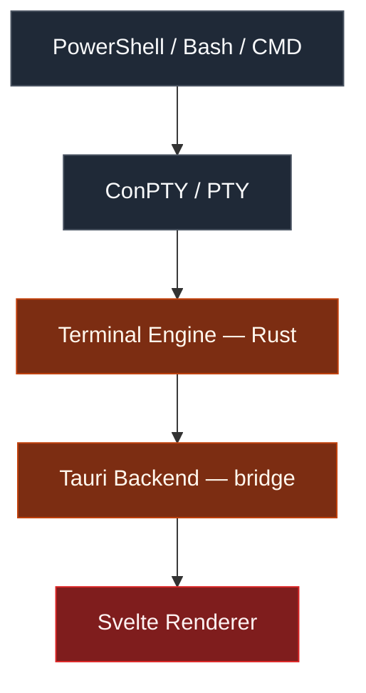
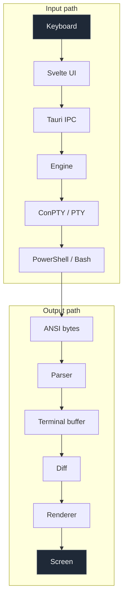

<div align="center">

<pre>
    ┌──────────────────────────────────────────────┐
    │  ●  ●  ●                            kyro  ─ □ ×
    ├──────────────────────────────────────────────┤
    │                                              │
    │   ARCHITECTURE  &  DESIGN                    │
    │   ────────────────────────────               │
    │                                              │
    │   $ how kyro is put together_                │
    │                                              │
    └──────────────────────────────────────────────┘
</pre>

**A living design document.**<br/>
Every major architectural and technology decision made so far.

<sub>Decisions here are current intent, not commitments. They change as the project learns.</sub>

</div>

---

## Contents

| | | |
| :--- | :--- | :--- |
| [Project](#project) | [Tech Stack](#tech-stack) | [High-Level Architecture](#high-level-architecture) |
| [Responsibilities](#responsibilities) | [Project Structure](#project-structure) | [Design Decisions](#design-decisions) |
| [Data Flow](#data-flow) | [Terminal Capabilities](#terminal-capabilities) | [Development Order](#development-order) |
| [Packaging](#packaging) | [Development Environment](#development-environment) | [Licensing](#licensing) · [Philosophy](#philosophy) |

---

## Project

**Name:** Kyro Terminal

### Goal

Build a fast, modern, highly customizable terminal emulator with **complete control
over the user experience** — rather than simply skinning an existing terminal.

### Target platforms

| Platform | Pseudoconsole | Status |
| :--- | :--- | :--- |
| **Windows** | ConPTY | Initial target |
| **Linux** | PTY | Planned |
| **macOS** | PTY | Planned |

---

## Tech Stack

| Layer | Choice | Notes |
| :--- | :--- | :--- |
| **UI** | Tauri · Svelte · TypeScript | Frontend and native shell |
| **Engine** | Rust | All terminal logic |
| **Windows** | ConPTY | Pseudoconsole API |
| **Linux / macOS** | PTY | Planned |
| **Parser** | Alacritty *or* WezTerm parser | Undecided — both are proven VT implementations |

---

## High-Level Architecture



Each layer talks only to its neighbours. No layer reaches past the one below it.

---

## Responsibilities

<table>
<tr>
<th align="left" width="33%">UI — <code>ui/src</code></th>
<th align="left" width="33%">Tauri — <code>ui/src-tauri</code></th>
<th align="left" width="33%">Engine — <code>engine</code></th>
</tr>
<tr>
<td valign="top">

Everything the user sees.

- Sidebar
- Tabs
- Split panes
- Settings
- Command palette
- Themes
- Terminal renderer
- Search UI
- Viewport
- Keyboard shortcuts

</td>
<td valign="top">

The bridge. Nothing more.

- Window management
- Native APIs
- IPC
- Exposing Rust commands
- Calling the engine
- Sending events to Svelte

</td>
<td valign="top">

All terminal logic.

- PTY management
- ANSI parsing
- Terminal buffer
- Sessions
- Cursor
- Screen state
- Platform abstraction
- Shell launching

</td>
</tr>
<tr>
<td valign="top"><sub>Knows nothing about ConPTY, PTYs, or ANSI parsing.</sub></td>
<td valign="top"><sub>Should contain <b>very little</b> business logic.</sub></td>
<td valign="top"><sub>Must remain independent of Tauri.</sub></td>
</tr>
</table>

---

## Project Structure

> [!NOTE]
> This is the **target** layout. Most directories do not exist yet — they are
> created as the corresponding feature is built.

```text
Terminal/
│
├── ui/
│   ├── src/
│   │   ├── components/
│   │   ├── layouts/
│   │   ├── routes/
│   │   ├── stores/
│   │   ├── services/
│   │   ├── terminal/
│   │   │   ├── renderer/
│   │   │   ├── viewport/
│   │   │   ├── selection/
│   │   │   └── search/
│   │   └── ipc/
│   │
│   └── src-tauri/
│
└── engine/
    ├── Cargo.toml
    └── src/
        ├── lib.rs
        ├── parser/
        ├── platforms/
        │   ├── windows/
        │   ├── linux/
        │   └── macos/
        │
        ├── core/
        │   ├── buffer/
        │   ├── cell/
        │   ├── cursor/
        │   ├── screen/
        │   ├── terminal/
        │   ├── session/
        │   ├── shell/
        │   ├── input/
        │   ├── output/
        │   ├── state/
        │   ├── events/
        │   ├── commands/
        │   ├── workspace/
        │   ├── tabs/
        │   ├── panes/
        │   ├── history/
        │   ├── selection/
        │   ├── clipboard/
        │   ├── search/
        │   ├── encoding/
        │   └── config/
        │
        └── integrations/
            ├── git/
            ├── ssh/
            ├── ai/
            └── plugins/
```

---

## Design Decisions

<details open>
<summary><b>The renderer belongs in the UI, not the engine</b></summary>

<br/>

Rendering depends on HTML, CSS, Canvas, WebGL/WebGPU, and font handling — all
frontend concerns.

**The engine only exposes terminal state.** It never decides how that state looks.

</details>

<details open>
<summary><b>The engine and UI share no vocabulary</b></summary>

<br/>

| The engine knows nothing about | The UI knows nothing about |
| :--- | :--- |
| Svelte | ConPTY |
| Tauri | PTYs |
| HTML | ANSI parsing |
| CSS | |

Both communicate through **Tauri IPC**. That boundary is the contract.

</details>

<details open>
<summary><b>Custom title bar, native decorations disabled</b></summary>

<br/>

The window chrome is drawn by the app itself:

- Title bar
- Tabs
- Window controls
- Sidebar
- Split panes

This is what makes the interface itself customizable, rather than only its colors.

</details>

<details open>
<summary><b>Single repository</b></summary>

<br/>

```text
Terminal/
├── .git/
├── ui/
└── engine/
```

The UI and engine are **one product with one release cycle**. Splitting them would
add coordination cost with no benefit.

</details>

---

## Data Flow



The **diff** step matters: the renderer receives changed cells, not a full buffer
copy, so redraw cost tracks what actually changed rather than terminal size.

---

## Terminal Capabilities

The terminal should eventually support:

| | | |
| :--- | :--- | :--- |
| ANSI escape sequences | True Color | UTF-8 |
| Mouse input | Alternate screen | Scrollback |
| Hyperlinks | Unicode | Emoji |
| Wide characters | | |

Together these enable compatibility with:

`git` · `npm` · `python` · `claude` · `vim` · `neovim` · `bash` · `powershell`

---

## Development Order

<table>
<tr>
<td valign="top" width="25%">

**Phase 1 — Plumbing**

1. ConPTY integration
2. Shell launch
3. PTY communication

</td>
<td valign="top" width="25%">

**Phase 2 — Terminal**

4. ANSI parser
5. Terminal buffer
6. Renderer

</td>
<td valign="top" width="25%">

**Phase 3 — Workspace**

7. Tabs
8. Split panes
9. Scrollback
10. Search
11. Workspace management

</td>
<td valign="top" width="25%">

**Phase 4 — Integrations**

12. Git integration
13. SSH integration
14. Plugin system
15. AI integration

</td>
</tr>
</table>

Nothing in a later phase starts before the phase beneath it works.

---

## Packaging

The engine is **compiled into** the Tauri application. No separate distribution.

```bash
pnpm tauri dev      # development window
pnpm tauri build    # release binary + installer
```

### Outputs

| Platform | Artifacts |
| :--- | :--- |
| **Windows** | `.exe` · `.msi` |
| **Linux** | `.deb` · `.rpm` · AppImage |
| **macOS** | `.app` · `.dmg` |

### Possible distribution channels

GitHub Releases · personal website · winget · Chocolatey · Homebrew · apt · Snap · Flatpak

---

## Development Environment

### Required

| Tool | Notes |
| :--- | :--- |
| **Rust** + **Cargo** | 1.85+ — the engine uses `edition = "2024"` |
| **Node.js** | 20+ |
| **pnpm** | 10+ |
| **Visual Studio Build Tools** | Windows only |

```bash
rustup component add rustfmt clippy
```

See [CONTRIBUTING.md](CONTRIBUTING.md) for the full setup and per-platform Tauri
dependencies.

### VS Code extensions

| Rust | Frontend | General |
| :--- | :--- | :--- |
| Rust Analyzer | Svelte for VS Code | Error Lens |
| CodeLLDB | | GitLens |
| Even Better TOML | | EditorConfig |

---

## Licensing

**[PolyForm Noncommercial 1.0.0](LICENSE.md)**

| Allowed | Requires permission |
| :--- | :--- |
| Source available | Commercial use |
| Community contributions | Paid distribution |
| Forks | Monetization |
| Personal use | |

---

## Philosophy

Kyro is intended to be **more than a themed terminal**.

The project aims to provide a modern, extensible desktop application with a
powerful terminal engine underneath — supporting workspaces, sidebars, plugins,
AI, Git integration, and other productivity tools, while maintaining native
performance.

<div align="center">

<sub>◇ ─────────────── ◇ ─────────────── ◇</sub>

<sub><b>Kyro Terminal</b> · <a href="./README.md">README</a> · <a href="./CONTRIBUTING.md">Contributing</a></sub>

<br/>

</div>
